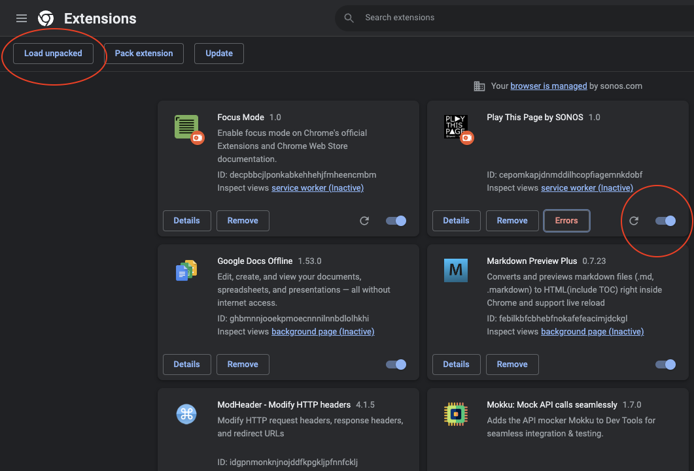
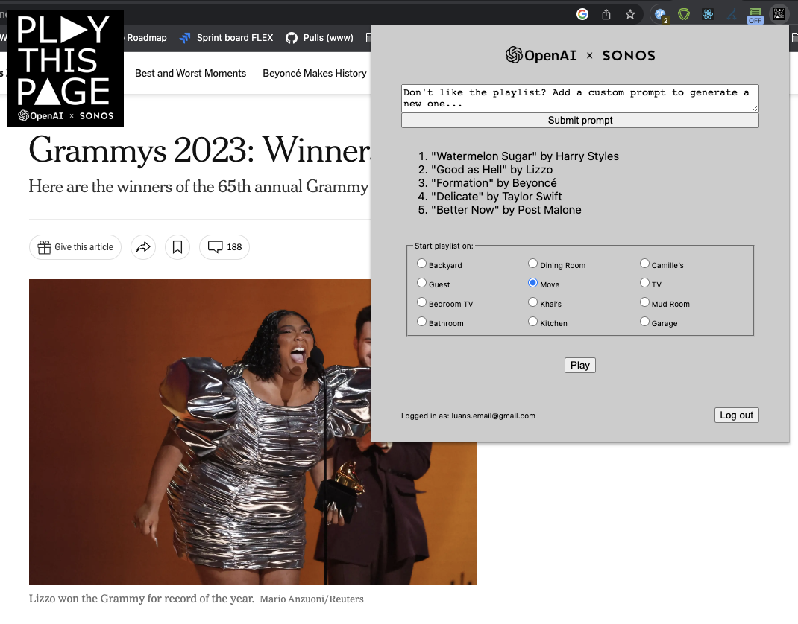

# Play This Page


**Welcome to Play This Page**

A simple Chrome Extension that will generate a playlist based on the webpage you are on. Then it will use Find & Play to *initiate playback on your SONOS system!*

## Getting Started

### Create a file at the root called `secrets.js`

The contents of `secrets.js` should be:
```
export const gptAPIKey = '<your OpenAI API key here>'
export const oktaToken = '<your base-64 encoded {username:password} here>'
```

You can reach out to *Luan Nguyen or Alex Nance* and we can give you these values.

### Install the Chrome Extension



1. Bring up the Extension Manager
2. Click on that "Load Unpacked" button
3. Select the root `play-this-page` folder to install

## Using the extension

Simply click the extension on any webpage.

### Logging in
Upon first usage, it will ask you to log in. Use your **production SONOS account** (an account that actually has speakers registered to it).

### Prompting
It will generate a playlist based on the webpage you are on. If you do not like the playlist it created, you can play with sending a custom prompt.

Try a prompt like `songs by other artists that feature a verse from eminem`

Or `songs to motivate me to do some work`

Just have fun and play around with it!

### Playing on your SONOS
Finally just select a speaker group and press **'Play'**



## Fun use cases

- Use it while shopping on any ecommerce website
- Create a dinner playlist as you're on a cooking/recipe webpage
- Use it while reading any news article; or maybe just on positive articles :)
- Use it on Wikipedia articles
- Definitely use on on music websites, like RollingStone.com

## Feedback?

Email luan.nguyen@sonos.com or alex.nance@sonos.com

